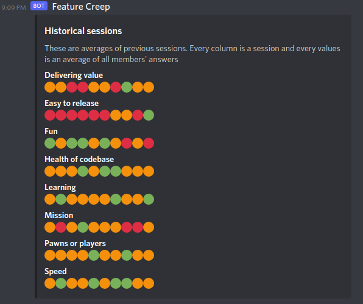

# Feature creep


## Installation

### Server

```sh
docker-compose up -d 
cd server
npm ci # Use "ci" so it respects the lockfile

# When running "npm start" you will be running in production mode
# This means, authentication will happen via JWTs provded by AWS Cognito
# See the folder infra/auth for details on how its set up
npm start

# When running "npm run dev" you will be running in development mode
# Any calls to the API are automatically authenticated
# This does mean only 1 user can exist in the database at any time
# It might get lonely in your solo squad :(
npm run dev
```

### Client

// TODO: Emiel

### Features

- Uses RedisJSON as main datastore
- Uses Redis Streams to trigger BG processing
- Users can create "Squads"
- Users can invite other users to join their Squad
- Users can start a Session in the context of a Squad
- A Session currently is a healthcheck, but can be expanded to other agile meetings in the future
- After a Session ends, background processing of the data happens (powered by Redis Gears). 
- After background processing, a report is sent to Discord 




### Squad health checks

[Health check model by Spotify](https://engineering.atspotify.com/2014/09/16/squad-health-check-model/)